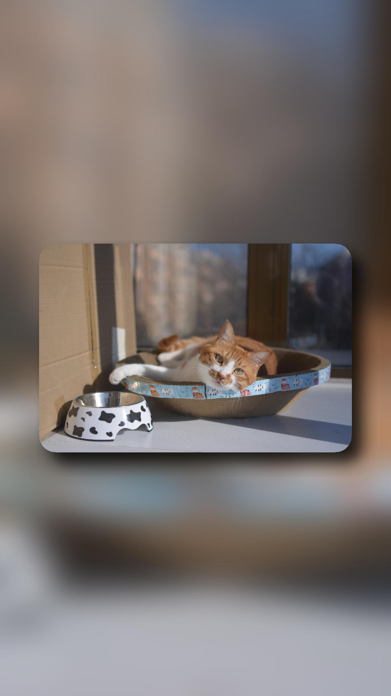

# BMPS lib

```sh
cargo run --example normalize -- -h
Usage: normalize [OPTIONS]
```
```text
Options:
  -w, --width [<WIDTH>]       Width [default: 1920]
  -H, --height [<HEIGHT>]     Height [default: 1080]
  -b, --blur [<BLUR>]         Blur radius [default: 50]
  -r, --round [<ROUND>]       Round radius [default: 45]
  -s, --shadow [<SHADOW>]     Shadow width [default: 40]
  -p, --padding [<PADDING>]   Range [0, 0.5) [default: 0.1]
  -i, --input [<INPUT_PATH>]  File or directory path [default: .]
  -o, --out [<OUTPUT>]        Output path [default: .]
  -h, --help                  Print help
```
Source file:

 


Landscape output:

 

Portrait output:

 
